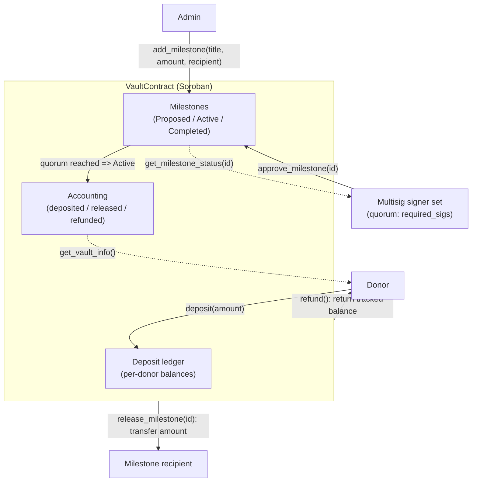
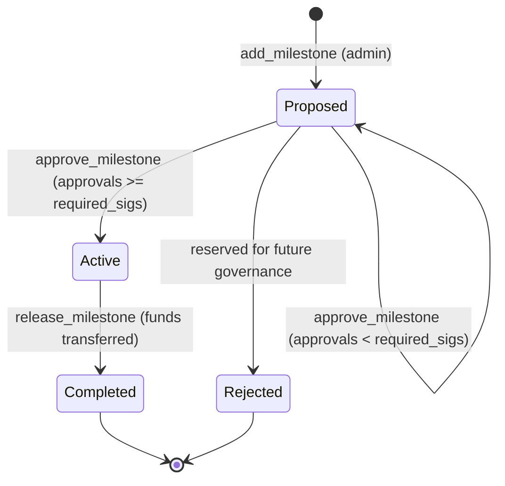

# StellarAid Vault Contract

> Transparent, milestone-based on-chain grant disbursement for the Stellar network, powered by Soroban.

**StellarAid** is a charitable-funding platform that removes the opacity from grant giving. Donors contribute tokens to a shared vault; an admin proposes concrete, funded milestones; a multisig quorum of trusted signers approves each milestone; and funds are released **directly to recipients** only after approval — every step recorded immutably on-chain. Unallocated funds can always be reclaimed by donors, so capital is never trapped.

This repository contains the **`stellaraid-vault`** Soroban smart contract that enforces these rules.

- Companion Backend: <https://github.com/Stellar-Aid/Stellar-Aid-Backend>
- Companion Frontend: <https://github.com/Stellar-Aid/Stellar-Aid-Frontend>

---

## Table of contents

- [Mission](#mission)
- [Architecture](#architecture)
- [Milestone lifecycle](#milestone-lifecycle)
- [Public interface](#public-interface)
- [Storage model](#storage-model)
- [Build, test & deploy](#build-test--deploy)
- [Security notes](#security-notes)
- [Ecosystem impact](#ecosystem-impact)
- [Repository layout](#repository-layout)
- [Contributing](#contributing)
- [License](#license)

---

## Mission

Traditional grant disbursement relies on trust in intermediaries and offers little visibility into how funds move. StellarAid replaces that trust with verifiable, programmatic rules:

- **Transparency** — every deposit, approval, release, and refund is an on-chain event.
- **Accountability** — funds move only when a milestone reaches its approval quorum.
- **Donor protection** — deposits remain reclaimable until they are released to a recipient.
- **Low cost & fast finality** — built on Stellar/Soroban for near-instant, low-fee settlement.

---

## Architecture

The vault sits between donors and recipients, mediating the flow of a single Stellar Asset Contract (SAC) token. An admin proposes milestones; a multisig signer set gates every release.



**Flow summary**

1. A **donor** calls `deposit` — tokens move into the vault and the donor's reclaimable balance is tracked.
2. The **admin** calls `add_milestone` — a `Proposed` milestone is created with a fixed amount and recipient.
3. **Signers** call `approve_milestone` — once unique approvals reach `required_sigs`, the milestone becomes `Active`.
4. Anyone can call `release_milestone` on an `Active` milestone — funds transfer to the recipient and the milestone becomes `Completed`.
5. A donor can call `refund` at any time to reclaim their entire remaining tracked balance.

---

## Milestone lifecycle



> `Rejected` is defined in the `MilestoneStatus` enum and reserved for a future governance path; the current contract transitions `Proposed -> Active -> Completed`.

---

## Public interface

All functions live in the `VaultContract` implementation. A generated `VaultContractClient` is available for tests and off-chain SDK usage.

| Function | Signature | Auth | Description |
| --- | --- | --- | --- |
| `initialize` | `(admin: Address, token: Address, signers: Vec<Address>, required_sigs: u32)` | — | One-time setup. Panics on re-init, empty `signers`, `required_sigs == 0`, or `required_sigs > signers.len()`. |
| `deposit` | `(donor: Address, amount: i128)` | `donor` | Transfers `amount` of the vault token from the donor into the vault and tracks the donor's reclaimable balance. Panics if `amount <= 0`. |
| `add_milestone` | `(caller: Address, title: String, description: String, amount: i128, recipient: Address) -> u32` | `caller` (= admin) | Creates a `Proposed` milestone and returns its auto-incremented ID (0-indexed). Panics if `caller` is not the admin or `amount <= 0`. |
| `approve_milestone` | `(signer: Address, milestone_id: u32)` | `signer` | Records a unique approval. When approvals reach `required_sigs`, the milestone becomes `Active`. Panics if the signer is unauthorized, has already approved, or the milestone is not `Proposed`. |
| `release_milestone` | `(milestone_id: u32)` | — | Transfers the milestone amount to its recipient and marks it `Completed`. Panics unless the milestone is `Active`. |
| `refund` | `(donor: Address)` | `donor` | Returns the donor's full tracked balance and clears their deposit record. Panics if the balance is not positive. |
| `get_milestone_status` | `(milestone_id: u32) -> Milestone` | — | Returns the full milestone struct. Panics if it does not exist. |
| `get_vault_info` | `() -> (i128, i128, i128)` | — | Returns `(total_deposited, total_released, total_refunded)`. |
| `get_donor_balance` | `(donor: Address) -> i128` | — | Returns the donor's current reclaimable balance (0 if none). |

### Types

```rust
pub enum MilestoneStatus { Proposed, Active, Completed, Rejected }

pub struct Milestone {
    pub id: u32,
    pub title: String,
    pub description: String,
    pub amount: i128,
    pub status: MilestoneStatus,
    pub recipient: Address,
}
```

---

## Storage model

The contract deliberately separates **instance** storage (small, global configuration and counters, read on nearly every call) from **persistent** storage (unbounded, keyed collections).

### Instance storage

Global, cheaply read alongside the contract instance:

| Key | Type | Purpose |
| --- | --- | --- |
| `Admin` | `Address` | Only address allowed to propose milestones. |
| `TokenAddress` | `Address` | The Stellar Asset Contract (SAC) token the vault holds. |
| `Signers` | `Vec<Address>` | Authorized multisig approver set. |
| `RequiredSigs` | `u32` | Quorum of approvals needed to activate a milestone. |
| `TotalDeposited` | `i128` | Cumulative deposits. |
| `TotalReleased` | `i128` | Cumulative funds released to recipients. |
| `TotalRefunded` | `i128` | Cumulative funds refunded to donors. |
| `MilestoneCount` | `u32` | Auto-increment counter for milestone IDs. |

### Persistent storage

Keyed, potentially unbounded records:

| Key | Type | Purpose |
| --- | --- | --- |
| `Milestone(u32)` | `Milestone` | A milestone keyed by its ID. |
| `Deposit(Address)` | `i128` | Per-donor reclaimable balance. |
| `Approval(u32, Address)` | `bool` | Marks that a signer approved a specific milestone (prevents double-counting). |

> **Why the split?** Instance storage keeps hot configuration and totals inexpensive to read on every invocation, while per-donor, per-milestone, and per-approval records are naturally unbounded and belong in persistent storage. In production, remember that persistent entries are subject to Soroban state archival and may require TTL bumping.

---

## Build, test & deploy

### Prerequisites

- **Rust** (stable) with the `wasm32-unknown-unknown` target
- **Stellar CLI** (`stellar`)

```bash
rustup target add wasm32-unknown-unknown
cargo install --locked stellar-cli --features opt
```

### Build the Wasm

```bash
stellar contract build
# Output: target/wasm32-unknown-unknown/release/stellaraid_vault.wasm
```

### Run the test suite

```bash
cargo test
cargo fmt -- --check
```

### Deploy to Stellar Testnet

The examples below use realistic placeholder identities and addresses — replace them with your own.

**1. Create and fund a deployer identity**

```bash
stellar keys generate --global deployer --network testnet --fund
stellar keys address deployer
# => GDEPLOYER... (your funded testnet account)
```

**2. Deploy the contract**

```bash
stellar contract deploy \
  --wasm target/wasm32-unknown-unknown/release/stellaraid_vault.wasm \
  --source deployer \
  --network testnet
# => CVAULT... (deployed contract ID)
```

Export it for convenience:

```bash
export VAULT_ID=CVAULT...        # contract ID from the deploy step
export TOKEN_ID=CDLZFC3S...      # SAC token contract ID (e.g. testnet USDC or a custom asset)
export ADMIN=GADMIN...
export SIGNER_1=GSIGNERONE...
export SIGNER_2=GSIGNERTWO...
export SIGNER_3=GSIGNERTHREE...
```

**3. Initialize the vault (2-of-3 multisig)**

```bash
stellar contract invoke \
  --id $VAULT_ID \
  --source deployer \
  --network testnet \
  -- \
  initialize \
  --admin $ADMIN \
  --token $TOKEN_ID \
  --signers "[\"$SIGNER_1\",\"$SIGNER_2\",\"$SIGNER_3\"]" \
  --required_sigs 2
```

**4. Deposit as a donor** (the donor identity must authorize)

```bash
stellar contract invoke \
  --id $VAULT_ID \
  --source donor \
  --network testnet \
  -- \
  deposit \
  --donor $(stellar keys address donor) \
  --amount 1000
```

**5. Propose a milestone (admin only)**

```bash
stellar contract invoke \
  --id $VAULT_ID \
  --source admin \
  --network testnet \
  -- \
  add_milestone \
  --caller $ADMIN \
  --title "Build Water Well" \
  --description "Dig and equip a well for the village" \
  --amount 500 \
  --recipient $(stellar keys address recipient)
# => returns the milestone ID, e.g. 0
```

**6. Approve the milestone (each signer)**

```bash
stellar contract invoke --id $VAULT_ID --source signer1 --network testnet \
  -- approve_milestone --signer $SIGNER_1 --milestone_id 0

stellar contract invoke --id $VAULT_ID --source signer2 --network testnet \
  -- approve_milestone --signer $SIGNER_2 --milestone_id 0
# After the 2nd approval, milestone 0 becomes Active.
```

**7. Release funds to the recipient**

```bash
stellar contract invoke \
  --id $VAULT_ID \
  --source deployer \
  --network testnet \
  -- \
  release_milestone \
  --milestone_id 0
```

**8. Inspect state (read-only)**

```bash
stellar contract invoke --id $VAULT_ID --source deployer --network testnet \
  -- get_vault_info

stellar contract invoke --id $VAULT_ID --source deployer --network testnet \
  -- get_milestone_status --milestone_id 0
```

---

## Security notes

- **Overflow checks** — the release profile enables `overflow-checks = true`, and every accumulator uses `checked_add` with an explicit panic on overflow. Arithmetic cannot silently wrap.
- **`require_auth` on every state-changing donor/admin/signer action** — `deposit`, `add_milestone`, `approve_milestone`, and `refund` require the acting address to authorize the call, so funds and privileged actions cannot be spoofed.
- **Multisig quorum** — a milestone becomes spendable only after `required_sigs` *unique* signers approve. Duplicate approvals are rejected via the `Approval(id, signer)` guard, and only addresses in the configured `Signers` set can approve.
- **Re-initialization guard** — `initialize` panics if the vault is already configured, preventing an attacker from resetting the admin, token, or signer set.
- **Status gating** — funds can only be released from an `Active` milestone, and an `Active`/`Completed` milestone can no longer be approved. This blocks double-release and post-activation approval races.
- **Donor fund safety** — refunds only ever return a donor's own tracked balance and clear the record atomically, preventing double refunds.

> These properties are enforced by the contract logic and covered by the unit tests in `contracts/vault/src/test.rs`. An independent audit is recommended before mainnet deployment with real value.

---

## Ecosystem impact

StellarAid is built to strengthen, and be strengthened by, the broader Stellar and Soroban ecosystem:

- **Composable public good** — the vault is a reusable, audited-by-design primitive for *any* milestone-gated funding use case (grants, bounties, disaster relief, public-goods funding), not just a single campaign.
- **Real-world asset flows** — by settling in Stellar Asset Contracts, the vault plugs directly into Stellar's stablecoin and anchor network, enabling on/off-ramps to local currencies where aid is actually spent.
- **Drips Network alignment** — StellarAid's milestone-and-quorum model complements continuous-funding protocols like **Drips Network**: donors can stream or batch contributions upstream, while StellarAid provides the accountable, milestone-gated *downstream* disbursement layer that proves funds reached their intended outcome. Together they close the loop from continuous funding to verifiable impact.
- **Transparency as infrastructure** — on-chain accounting (`get_vault_info`, `get_milestone_status`) gives dashboards, auditors, and grant DAOs a canonical source of truth, reducing the cost of trust across the ecosystem.
- **Developer onboarding** — a clean, well-documented Soroban contract with a full test suite serves as a reference implementation for teams new to Stellar smart contracts.

---

## Repository layout

```
Stellar-Aid-contracts/
├── Cargo.toml                     # Workspace root (soroban-sdk 21.7.4)
├── contracts/
│   └── vault/
│       ├── Cargo.toml             # stellaraid-vault package (cdylib)
│       └── src/
│           ├── lib.rs             # Vault contract implementation
│           └── test.rs            # Unit tests (soroban-sdk testutils)
├── .github/
│   ├── CODEOWNERS
│   └── workflows/ci.yml           # build + test + fmt on push/PR
├── README.md
└── CONTRIBUTING.md
```

---

## Contributing

Contributions are welcome. Please read [CONTRIBUTING.md](CONTRIBUTING.md) for development setup, branch and PR conventions, and the review checklist before opening a pull request.

## License

See the repository license file for details.
